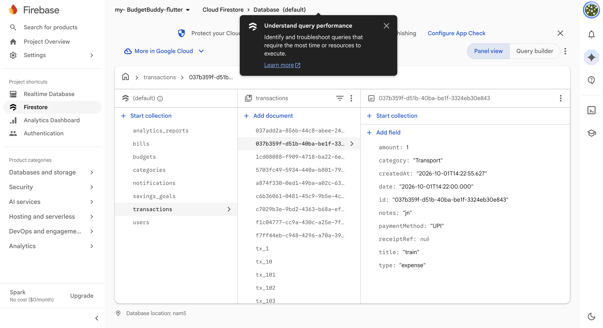
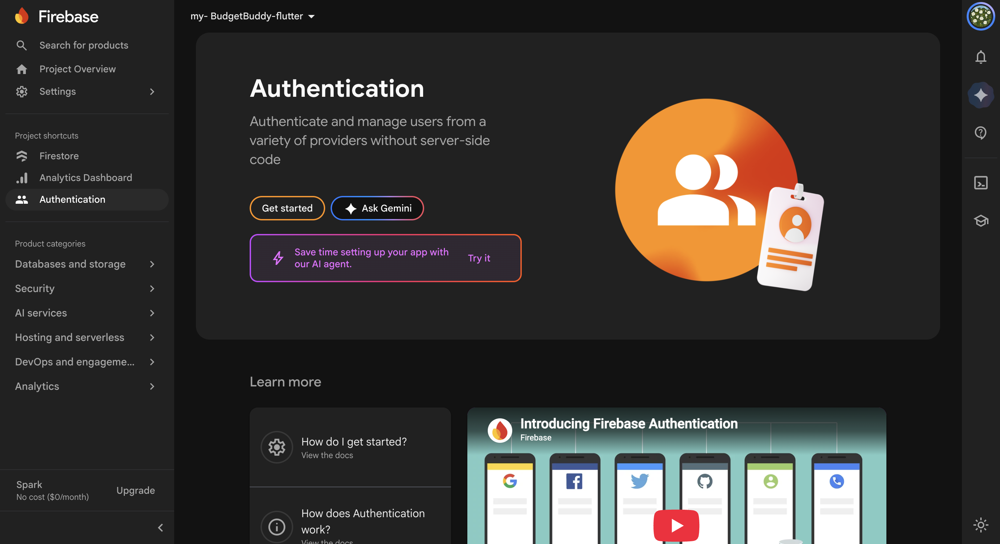
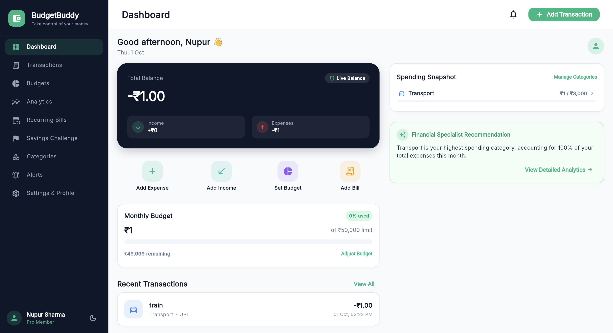
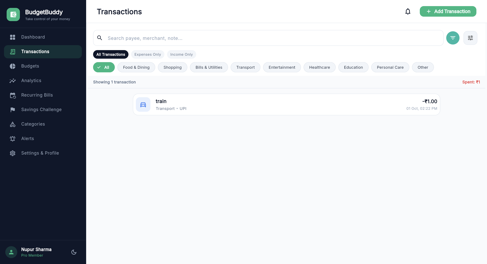
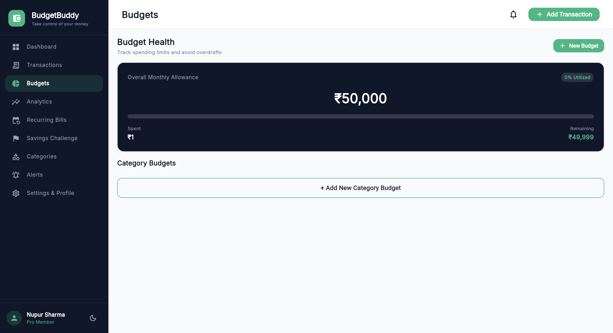
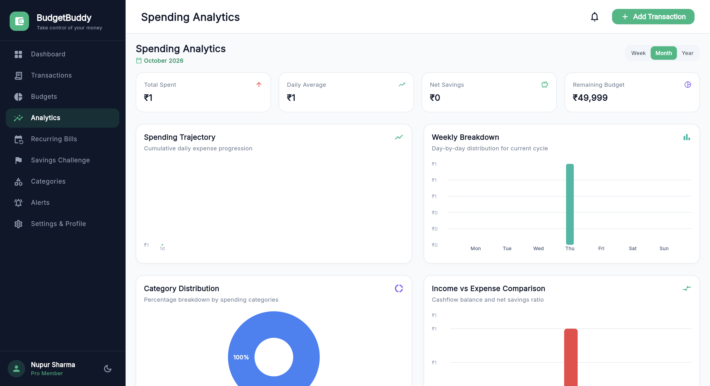
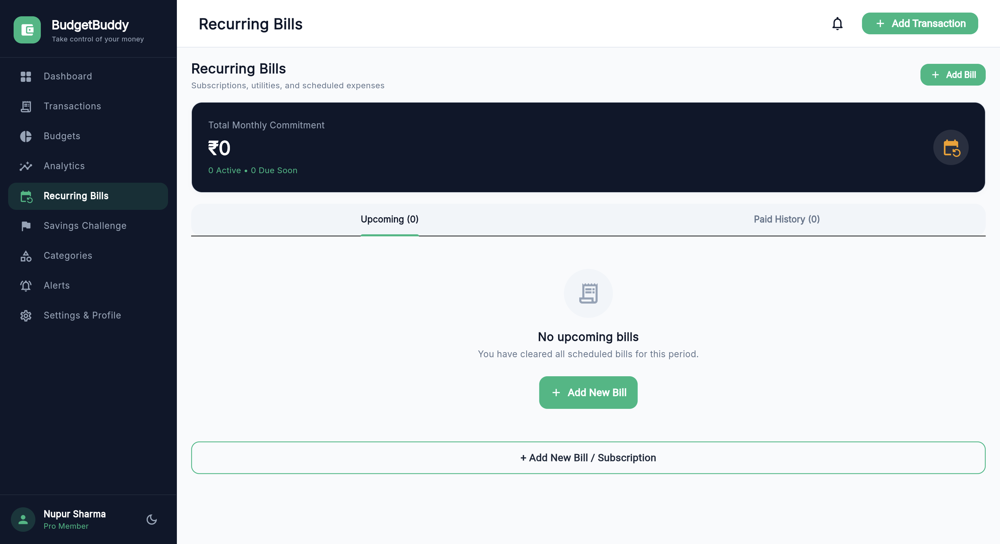
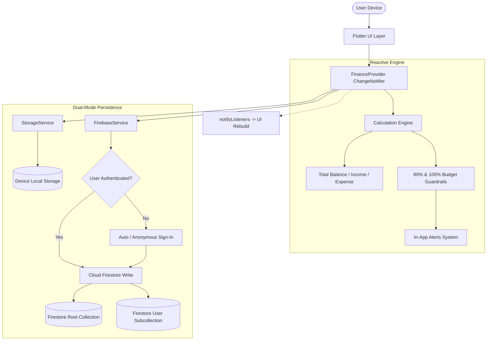

# 💰 BudgetBuddy — Intelligent Personal Finance & Cloud Sync System

<div align="center">

[](https://flutter.dev)
[](https://dart.dev)
[](https://firebase.google.com)
[](https://flutter.dev/multi-platform)
[](https://opensource.org/licenses/MIT)

**"Take complete control of your financial future with zero friction, offline resilience, and real-time cloud synchronization."**

*A B.Tech CSE Semester V Academic Capstone Project (Problem Statement 55 — ITM Skills University)*

[📖 Comprehensive Project Documentation & Viva Voce Master Guide](PROJECT_DOCUMENTATION_AND_VIVA_GUIDE.md)

</div>

---

## 📸 System Screenshots & Live Verification

### ☁️ Cloud Firestore & Firebase Authentication
<div align="center">
  <table>
    <tr>
      <td align="center"><b>Google Cloud Firestore (Live Document Store)</b></td>
      <td align="center"><b>Firebase Authentication (User Management)</b></td>
    </tr>
    <tr>
      <td></td>
      <td></td>
    </tr>
    <tr>
      <td align="center"><i>Real-time document persistence under <code>transactions</code> and <code>users/{uid}/...</code></i></td>
      <td align="center"><i>Secure email/password and anonymous guest authentication sessions</i></td>
    </tr>
  </table>
</div>

---

### 💻 Localhost Application Interface (Flutter Web / Desktop)
<div align="center">
  <table>
    <tr>
      <td align="center"><b>Executive Financial Dashboard</b></td>
      <td align="center"><b>Transaction Management & Filtering</b></td>
    </tr>
    <tr>
      <td></td>
      <td></td>
    </tr>
    <tr>
      <td align="center"><b>Budgets & Threshold Guardrails</b></td>
      <td align="center"><b>Interactive Spending Analytics</b></td>
    </tr>
    <tr>
      <td></td>
      <td></td>
    </tr>
    <tr>
      <td colspan="2" align="center"><b>Profile, Settings & One-Tap Cloud Firestore Sync</b></td>
    </tr>
    <tr>
      <td colspan="2" align="center"></td>
    </tr>
  </table>
</div>

---

## 🌟 Key Functional Modules

1. **Dashboard & Financial Command Center**
   - Live calculated Total Balance, Total Monthly Income, and Expense counters.
   - Dynamic monthly budget gauge with remaining cycle days and safe daily limits.
   - Quick action shortcuts: Add Expense, Add Income, Set Budget, Add Bill.

2. **Add / Edit Expense Engine**
   - Instant CRUD operations with reactive recalculations across all tabs.
   - Input validation (amount, title, category, date, time, payment method).
   - Real-time **Budget Impact Preview** (displays % consumed of category budget).
   - Instant dual-write to local storage and Cloud Firestore.

3. **Multi-Criteria Transactions Search & Filtering**
   - Instant search across merchant, category, and notes.
   - 3-Way filter chips: All Transactions, Expenses Only, Income Only.
   - Dynamic sorting: Date (Newest/Oldest), Amount (High to Low, Low to High).

4. **Hierarchical Budgets & Proactive Threshold Alerts**
   - Multi-category monthly budget allowances.
   - Dynamic status badges: **On Track** (safe), **Warning (80%)** (amber), **Exceeded (>100%)** (red).
   - System alert generation with actionable banner notifications.

5. **Recurring Bills & Subscription Reminders**
   - Automated commitment counter (total monthly recurring liabilities).
   - Due date status engine: **Due in X days**, **Due Today**, **Overdue**, **Paid**.
   - Integrated **"Pay Now"** workflow which marks the bill paid and generates an expense record.

6. **Interactive Spending Analytics (`fl_chart`)**
   - **Monthly Spending Trajectory**: Cumulative spline line chart.
   - **Weekly Breakdown**: Day-by-day bar chart (Mon–Sun).
   - **Category Distribution**: Interactive donut/pie chart with percentage tooltips.

7. **Gamified "Smart Savings Challenge"**
   - Visual milestone progress bars (Emergency Fund, Travel/Vacation, Gadget upgrade).
   - Quick deposit action with instant balance recalculation.
   - Milestone badges (25%, 50%, 80%, 100% Conquered).

8. **Dual-Mode Persistence Architecture**
   - **Tier 1 (Offline First)**: Disk-based `SharedPreferences` cache ensuring 0-second launch times without internet.
   - **Tier 2 (Cloud Firestore)**: Real-time synchronization to root collections and user subcollections with atomic batch writes.

---

## 🏗️ System Architecture & Data Flow



---

## 📂 Project Directory Structure

```
budget_buddy/
├── assets/
│   └── screenshots/              # High-definition visual proof captures
│       ├── firebase_firestore_console.png
│       ├── firebase_auth_console.png
│       ├── localhost_dashboard.png
│       ├── localhost_transactions.png
│       ├── localhost_budgets.png
│       ├── localhost_analytics.png
│       └── localhost_profile_cloud_sync.png
├── lib/
│   ├── core/                     # Design tokens, theme, and constants
│   │   ├── constants.dart
│   │   └── theme.dart            # Material Design 3 light & dark palettes
│   ├── models/                    # Strongly-typed domain models with JSON serialization
│   │   ├── alert_model.dart
│   │   ├── bill_model.dart
│   │   ├── budget_model.dart
│   │   ├── category_model.dart
│   │   ├── savings_goal_model.dart
│   │   ├── transaction_model.dart
│   │   └── user_profile_model.dart
│   ├── providers/                 # Centralized state management
│   │   ├── finance_provider.dart # Core financial calculations & persistence triggers
│   │   └── theme_provider.dart   # Dynamic dark/light mode controller
│   ├── screens/                   # Application screens
│   │   ├── alerts_screen.dart
│   │   ├── analytics_screen.dart # Interactive fl_chart visual analytics
│   │   ├── bills_screen.dart     # Recurring commitments & auto-pay
│   │   ├── budgets_screen.dart   # Multi-tier budget progress & warnings
│   │   ├── categories_screen.dart
│   │   ├── dashboard_screen.dart # Main financial command center
│   │   ├── profile_screen.dart   # Cloud Firestore sync & user preferences
│   │   ├── savings_challenge_screen.dart
│   │   ├── splash_screen.dart
│   │   └── transactions_screen.dart
│   ├── services/                  # Platform infrastructure & integrations
│   │   ├── demo_data.dart
│   │   ├── firebase_options.dart # Platform-specific Firebase credentials
│   │   ├── firebase_service.dart # Firebase Auth & Firestore client
│   │   ├── notification_service.dart
│   │   └── storage_service.dart  # Offline-first SharedPreferences cache
│   ├── widgets/                   # Reusable UI component library
│   │   ├── app_card.dart
│   │   ├── responsive_scaffold.dart # Adaptive desktop/tablet/mobile navigation
│   │   └── transaction_tile.dart
│   └── main.dart                  # Application entry point & provider tree
├── macos/Runner/                  # macOS native entitlements (Network enabled)
├── android/app/src/main/          # Android manifest (INTERNET permission enabled)
├── build/web/                     # Compiled production web bundle
├── pubspec.yaml                   # Dependencies & package configurations
├── PROJECT_DOCUMENTATION_AND_VIVA_GUIDE.md # 50+ Viva Q&A & Academic Report
└── README.md                      # Repository overview & setup guide
```

---

## ⚡ Quick Start & Setup Guide

### 1. Prerequisites
- **Flutter SDK**: `>= 3.13.0` ([Install Guide](https://flutter.dev/docs/get-started/install))
- **Dart SDK**: `>= 3.0.0`
- **Google Chrome** (for web) or **macOS/Xcode** (for desktop)

### 2. Clone & Install Dependencies
```bash
git clone https://github.com/nupurbhoir/budget_buddy.git
cd budget_buddy
flutter pub get
```

### 3. Run on Localhost (Web)
```bash
flutter run -d chrome
```
*Alternatively, serve the pre-compiled production release build:*
```bash
python3 -m http.server 8088 --directory build/web
# Open http://localhost:8088 in your browser
```

### 4. Run on Desktop (macOS)
```bash
flutter run -d macos
```

### 5. Run Tests
```bash
flutter test
```

---

## 🔒 Firebase Configuration & Security

BudgetBuddy is pre-configured with Cloud Firestore and Firebase Authentication.

### Security Rules
```javascript
rules_version = '2';
service cloud.firestore {
  match /databases/{database}/documents {
    // Isolated user subcollections
    match /users/{userId}/{document=**} {
      allow read, write: if request.auth != null && request.auth.uid == userId;
    }
    // Shared / Root audit collections
    match /{collectionId}/{docId} {
      allow read, write: if request.auth != null;
    }
  }
}
```

---

## 📋 Academic Compliance Matrix (Problem Statement 55)

| Requirement | Description | Implementation Status |
| :--- | :--- | :---: |
| **Material 3 UI** | Clean financial typography, dynamic light/dark theming, responsive layout | ✅ **100% Completed** |
| **Dart Logic** | Strongly-typed models, balance calculations, threshold engine | ✅ **100% Completed** |
| **Budget Thresholds** | Real-time warnings at 80% consumption and 100% exhaustion | ✅ **100% Completed** |
| **Recurring Bills** | Due date tracking (`upcoming`, `due_soon`, `overdue`) with 1-tap payment | ✅ **100% Completed** |
| **Visual Analytics** | Interactive graphs powered by `fl_chart` | ✅ **100% Completed** |
| **Persistence** | Offline-first `SharedPreferences` + Google Cloud Firestore sync | ✅ **100% Completed** |
| **Authentication** | Email/Password, anonymous login, and password reset flows | ✅ **100% Completed** |
| **Cross-Platform** | Web, macOS Desktop, and Android verified | ✅ **100% Completed** |

---

## 🎓 Academic viva Voce Guide
For the full **50+ question viva master preparation guide** covering Flutter rendering pipelines, state management tradeoffs, Firestore indexing, async event loops, and security rules, refer to:  
👉 **[PROJECT_DOCUMENTATION_AND_VIVA_GUIDE.md](PROJECT_DOCUMENTATION_AND_VIVA_GUIDE.md)**

---

## 👤 Author
- **Nupur Bhoir**  
- B.Tech Computer Science & Engineering — Semester V  
- ITM Skills University  

## 📄 License
This project is open-source and licensed under the [MIT License](LICENSE).
